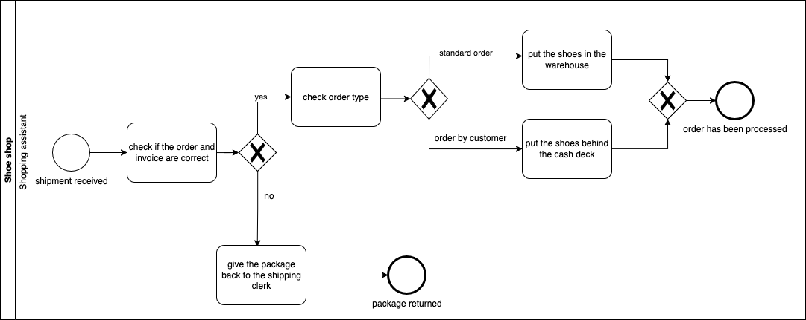
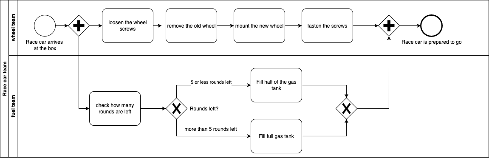
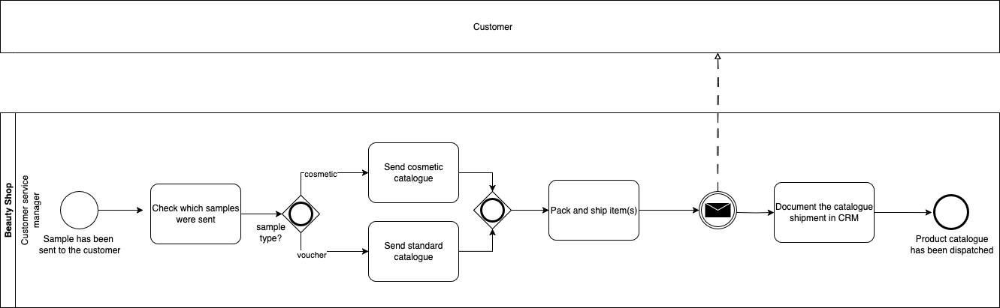
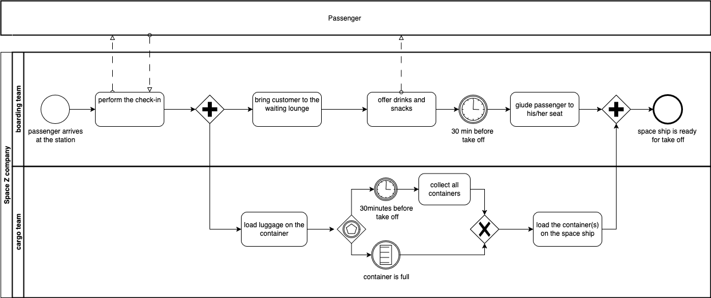
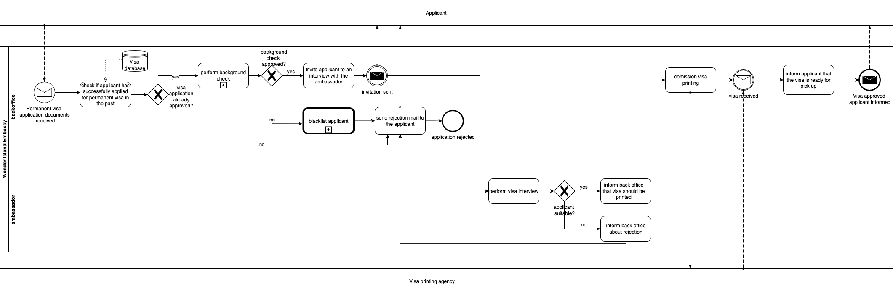
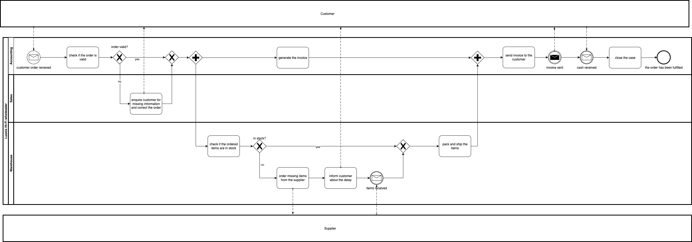

# BPMN Course Exercises

This folder contains BPMN diagrams I created using **draw.io** as part of my hands-on practice from **The Ultimate BPMN Course**. Each diagram represents a real-world business scenario, modeled with BPMN 2.0 standards to practice clarity, logic, and structure in process modeling.

---

## 1. 📦 Shoe: Max's First Week

**Scenario:**  
Max is a new shop assistant and receives a shipment. He must verify its accuracy and decide what to do next based on the type of order.

**Key Process Points:**
- Check if the order and invoice match.
- If incorrect → return to the shipping clerk.
- If correct:
  - Standard order → place in warehouse.
  - Customer order → place behind the cash desk.

**BPMN Diagram:**  

---

## 2. 🏎️ Race: The Pit Stop

**Scenario:**  
During a race, Gonzales wants both the tire change and fuel refill teams to work in parallel, with the fuel team adjusting based on remaining laps.

**Key Process Points:**
- Tire team replaces all wheels.
- Fuel team:
  - Checks remaining laps.
  - 5 or less laps → fill half tank.
  - more than 5 laps → fill full tank.
- Both actions start in parallel once the car enters the pit.

**BPMN Diagram:**  

---

## 3. 💄 Beauty: Customer Catalogue Process

**Scenario:**  
Susan wants to improve customer experience by sending tailored catalogues based on the type of sample sent.

**Key Process Points:**
- Check what was sent to the customer.
  - Cosmetic product → send cosmetic catalogue.
  - Voucher → send standard catalogue.
  - Both → send both catalogues.
- Log the catalogue shipment in the CRM system.

**BPMN Diagram:**  

---

## 4. 🛸 Space Station: Boarding and Cargo Handling

**Scenario:**  
When a passenger arrives at the space station, two teams begin their work in parallel:

- **Boarding Team**:
  - Performs check-in
  - Escorts the passenger to the waiting lounge
  - Offers cold drinks and snacks
  - 30 minutes before take-off → escorts the passenger to their seat on the spaceship

- **Cargo Team**:
  - Loads the passenger's luggage into the cargo container after check-in
  - Two possible events can trigger container loading onto the spaceship:
    1. The cargo container becomes full
    2. Only 30 minutes remain before take-off

  In either case, the container(s) are loaded onto the spaceship.

The spaceship is ready for take-off **only when both**:
- The passenger is seated, and
- The cargo has been fully loaded

**BPMN Diagram:**  

---

---

## 5. 🌴 Wonder Island: Permanent Visa Application

**Scenario:**  
An applicant applies for a **permanent visa** on Wonder Island. The process includes document submission, eligibility checks, background verification, an interview, and either approval or rejection — with serious consequences if the applicant fails the checks.

**Process Flow Overview:**

1. **Application Submitted**  
   - The applicant sends in all required documents for a permanent visa.

2. **Regular Visa Check**  
   - The back office checks whether the applicant has already successfully applied for a **regular visa**.
   - If not → the applicant is **rejected** immediately.

3. **Background Check**  
   - If the regular visa was approved, a background check is initiated.
   - If the applicant fails → they are **rejected and blacklisted**.

4. **Interview with the Ambassador**  
   - If the background check is passed → the applicant is invited for a **personal interview**.
   - If the interview fails → the applicant is **rejected**.

5. **Approval and Visa Issuance**  
   - If the interview is successful → the permanent visa is commissioned.
   - Once printed, the back office **notifies the applicant** to collect it.

**BPMN Diagram:**  

---

## 6. 📦 Luxxis: Order Received to Order Fulfilled

**Scenario:**  
Luxxis, a Hi-Fi equipment wholesaler, wants to optimize its core order fulfillment process. The goal is timely delivery and consistent communication with the customer.

**Process Flow Overview:**

1. Customer places an order.
2. **Accounting** checks order validity.
   - If invalid → **Sales** contacts customer to correct the order.
3. **Warehouse** checks stock:
   - If in stock → pack and ship items.
   - If not in stock → order from supplier and inform customer of delay, then pack and ship when items arrive.
4. After shipping → send shipping confirmation to customer.
5. **Accounting** generates and sends the invoice.
6. Once payment is received → order is marked as fulfilled.

**BPMN Diagram:**  

---

## Tools Used

- [draw.io / diagrams.net](https://draw.io/)
- BPMN 2.0 notation

---

## License

These diagrams are created for educational and portfolio purposes, based on scenarios provided in **The Ultimate BPMN Course**.
